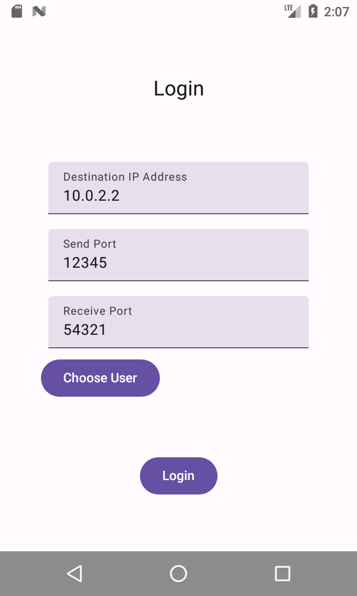
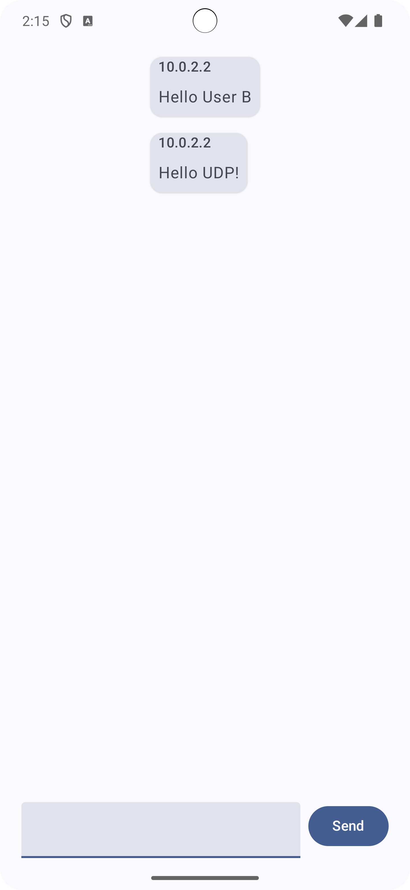

# UDP Chat

## Overview

_UDP Chat_ is a small Chat app for two clients that showcases the ease of use of flows in combination 
with Jetpack Compose for network traffic using udp as protocol.

## Technologies

_Android_ | _Kotlin_ | _Jetpack Compose_ | _Flow_ | _udp_

## Images




## Usage

### Prerequisites

- Android Studio (See: https://developer.android.com/studio/install)
- 2 Android Devices (For setting up forwarding on emulators see: https://developer.android.com/studio/run/emulator-networking)

### Installation

1. Clone this repository:
   ```bash
   git clone https://github.com/chris-prenissl/udp-chat.git
   ```
2. Start the app on both devices
3. Choose corresponding end-points yourself or choose User A for one device and User B for the other.

## License

This project is licensed under the MIT License - see the [LICENSE](LICENSE) file for details.